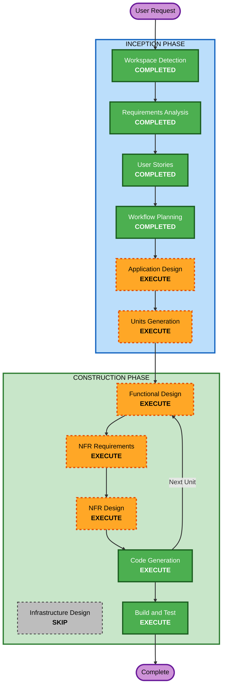

# Execution Plan

## Detailed Analysis Summary

### Change Impact Assessment
- **User-facing changes**: Yes — 全機能が新規ユーザー向け（WYSIWYG編集、ファイル管理、プラットフォーム連携）
- **Structural changes**: Yes — 新規アプリケーションアーキテクチャ（Tauri + SvelteKit + プラグインシステム）
- **Data model changes**: Yes — 記事データモデル、プラグインマニフェスト、プラットフォーム設定
- **API changes**: Yes — プラットフォーム連携アダプターAPI、プラグインAPI
- **NFR impact**: Yes — 起動速度最適化、プラグイン遅延読み込み

### Risk Assessment
- **Risk Level**: Medium
- **Rollback Complexity**: Easy（Greenfield、既存システムへの影響なし）
- **Testing Complexity**: Moderate（WYSIWYG編集のE2Eテスト、プラットフォームAPI連携のモックテスト）

---

## Workflow Visualization



### Text Alternative

```
Phase 1: INCEPTION
- Workspace Detection      (COMPLETED)
- Requirements Analysis     (COMPLETED)
- User Stories              (COMPLETED)
- Workflow Planning         (COMPLETED)
- Application Design        (EXECUTE)
- Units Generation          (EXECUTE)

Phase 2: CONSTRUCTION (per-unit loop)
- Functional Design         (EXECUTE, per-unit)
- NFR Requirements          (EXECUTE, per-unit)
- NFR Design                (EXECUTE, per-unit)
- Infrastructure Design     (SKIP)
- Code Generation           (EXECUTE, per-unit)
- Build and Test            (EXECUTE)

Phase 3: OPERATIONS
- Operations                (PLACEHOLDER)
```

---

## Phases to Execute

### INCEPTION PHASE
- [x] Workspace Detection (COMPLETED)
- [x] Reverse Engineering (SKIPPED — Greenfield)
- [x] Requirements Analysis (COMPLETED)
- [x] User Stories (COMPLETED)
- [x] Workflow Planning (COMPLETED)
- [ ] Application Design - **EXECUTE**
  - **Rationale**: 新規アプリケーション。コンポーネント構成（エディターコア、ファイルマネージャー、プラットフォームアダプター、プラグインシステム）の設計が必要。サービスレイヤーとコンポーネント間の依存関係を定義する。
- [ ] Units Generation - **EXECUTE**
  - **Rationale**: MVP 16ストーリーを複数の作業単位に分解する必要がある。エディターコア、ファイル管理、Zenn連携は並行開発困難なため、依存順序の整理が必要。

### CONSTRUCTION PHASE（各ユニットごとに繰り返し）
- [ ] Functional Design - **EXECUTE**
  - **Rationale**: WYSIWYG編集のデータモデル（ProseMirror Document構造）、プラグインAPIの設計、プラットフォームアダプターのインターフェース設計が必要。
- [ ] NFR Requirements - **EXECUTE**
  - **Rationale**: 起動速度1秒以内の目標、プラグイン遅延読み込み戦略、技術スタックの最終選定（SvelteKit + Tiptap + Tauri）が必要。
- [ ] NFR Design - **EXECUTE**
  - **Rationale**: NFR Requirementsの結果をアーキテクチャに反映。バンドル分割戦略、遅延読み込みパターン、パフォーマンスバジェットの設計が必要。
- [ ] Infrastructure Design - **SKIP**
  - **Rationale**: デスクトップ/Webアプリであり、クラウドインフラストラクチャの設計は不要。Tauriの設定はCode Generationで対応。
- [ ] Code Generation - **EXECUTE** (ALWAYS)
  - **Rationale**: 各ユニットの実装コード生成。
- [ ] Build and Test - **EXECUTE** (ALWAYS)
  - **Rationale**: ビルドとテストの手順書生成。

### OPERATIONS PHASE
- [ ] Operations - PLACEHOLDER

---

## Success Criteria
- **Primary Goal**: ブログ記事をWYSIWYGで快適に執筆し、Zennに直接投稿できるMVPを完成させる
- **Key Deliverables**:
  - 動作するTauri + SvelteKit アプリケーション
  - WYSIWYGエディター（Tiptap/ProseMirror）
  - ワークスペース型ファイル管理
  - Zenn連携（投稿・画像アップロード）
  - HTML/Markdownエクスポート
  - プラグインシステム基盤（Post-MVP向け）
- **Quality Gates**:
  - 起動時間1秒以内
  - 全MVP受け入れ基準のクリア
  - ユニットテスト・結合テストの通過
